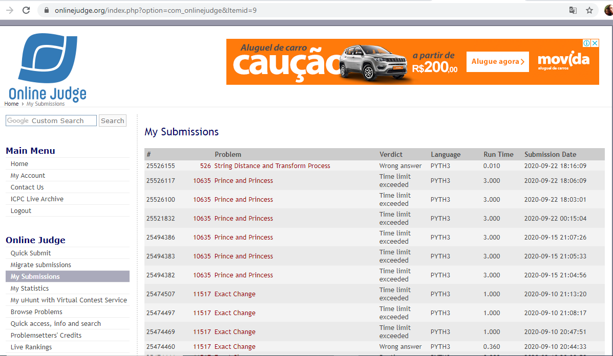

# Trabalho de Programação -- Programação Dinâmica -- Parte 2
**Autor:** Edimar Antonio da Cruz
**Data:** 17 de setembro de 2020
**Problema:** 10635 -- Prince and Princess
## Sobre a Solução
Este diretório contém o código fonte gerado para solucionar o problema 10635
do *Online Judge*. O problema recebeu veredito \Time limit exceeded", como mostrado na
figura abaixo:

O programa foi desenvolvido em Python. Este código foi submetido ao debug onde 
rodou sem mostrar erros, mas ao submete-lo ele deu esse veredito.
